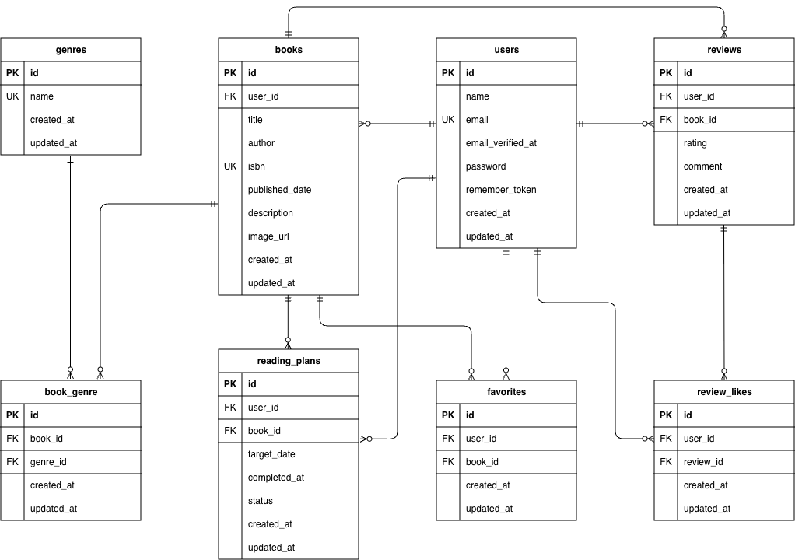

# BookShelf（新模擬案件\_書籍レビューアプリ）

## アプリ概要

書籍の登録・閲覧・お気に入り登録、レビューの投稿ができる書籍レビューアプリです。<br>
ジャンルによる分類やレビューへのいいね機能、平均評価に基づくランキング機能も備えています。

### 主な機能

- 会員登録
- ログイン
- 書籍登録
- 書籍検索
- ジャンル管理
- レビュー投稿
- レビューへのいいね
- お気に入り
- ランキング
- 読書計画
- 読書計画の通知
- マイ読書レポート
- ISBN検索
- 公開API

## ER図



## 環境構築

1. リポジトリをクローン

```bash
git clone git@github.com:yuyu580905-dev/bookshelf-app.git
```

2. プロジェクトディレクトリへ移動

```bash
cd bookshelf-app
```

3. 環境変数ファイルを作成

```bash
cp .env.example .env
```

4. Composer依存パッケージをインストール

```bash
composer install
```

5. Sailを起動

```bash
./vendor/bin/sail up -d
```

> `sail` コマンドを短く実行する場合は、以下のエイリアスを設定してください。
>
> ```bash
> alias sail='[ -f sail ] && bash sail || bash vendor/bin/sail'
> ```

6. アプリケーションキーを生成

```bash
sail artisan key:generate
```

7. マイグレーション＋シーディング実行

```bash
sail artisan migrate --seed
```

> DBを初期状態にリセットする場合は、以下を実行してください。
>
> ```bash
> sail artisan migrate:fresh --seed
> ```

8. npm依存パッケージをインストール

```bash
sail npm install
```

9. フロントエンドをビルド

```bash
sail npm run build
```

> フロントエンドを開発する場合は、以下を実行してください。
>
> ```bash
> sail npm run dev
> ```

## 使用技術（実行環境）

- PHP 8.5
- Laravel 10
- Laravel Sail
- MySQL 8.4
- phpMyAdmin
- Tailwind CSS 3.4
- Alpine.js 3
- Vite 5
- Laravel Sanctum
- Laravel Fortify
- Google Books API
- Docker

## API

本アプリでは、書籍管理用の公開APIと、ISBN検索機能を実装しています。

### エンドポイント

| Method | URL                  | 概要         | 認証・認可                     |
| ------ | -------------------- | ------------ | ------------------------------ |
| GET    | /api/v1/books        | 書籍一覧取得 | 不要                           |
| GET    | /api/v1/books/{book} | 書籍詳細取得 | 不要                           |
| POST   | /api/v1/books        | 書籍登録     | Sanctum                        |
| PUT    | /api/v1/books/{book} | 書籍更新     | Sanctum + Policy（所有者のみ） |
| DELETE | /api/v1/books/{book} | 書籍削除     | Sanctum + Policy（所有者のみ） |
| GET    | /books/isbn/{isbn}   | ISBN検索     | ログイン必須                   |

### 認証

- GET `/api/v1/books` および GET `/api/v1/books/{book}` は認証不要
- POST / PUT / DELETE は Laravel Sanctum による認証が必要

## 読書計画のバッチ処理

読書計画について、以下の処理をArtisanコマンドで実装しています。

- 期限切れの読書計画を自動的に「期限切れ」へ更新
- 期限日の3日前にリマインダー通知
- 期限日にリマインダー通知
- 期限日の3日後にリマインダー通知

### 手動実行

以下のコマンドで手動実行できます。

```bash
sail artisan reading-plans:process
```

※本番環境ではLaravelのスケジューラにより、毎日9:00に自動実行されます。

## Google Books API について

本アプリではISBN検索に Google Books API を使用しています。

### Google Books API 設定

1. [Google Cloud Console](https://console.cloud.google.com/)でプロジェクトを作成します。
2. Google Books APIを有効化します。
3. APIキーを発行します。
4. `.env` に以下を設定します。

```env
GOOGLE_BOOKS_API_KEY=発行したAPIキー
```

5. APIキーの設定後、アプリケーションを起動してISBN検索機能を利用します。

> **注意:** APIキーは機密情報のため、Gitなどの公開リポジトリにコミットしないでください。`.env.example` には実際のAPIキーを記載せず、空欄のままにしてください。

## テストアカウント

シーディング実行後、以下のユーザーでログインできます。

| ユーザー | メールアドレス        | パスワード |
| -------- | --------------------- | ---------- |
| 山田太郎 | yamada@example.com    | password   |
| 鈴木花子 | suzuki@example.com    | password   |
| 田中一郎 | tanaka@example.com    | password   |
| 佐藤美咲 | sato@example.com      | password   |
| 高橋健太 | takahashi@example.com | password   |

## PHPUnit テスト実行

```bash
sail artisan test
```

## URL

- 開発環境：http://localhost/
- phpMyAdmin：http://localhost:8080/

## 作成者

松本友介
